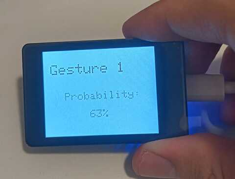

# IoT Gesture Challenge

A movement gesture identifier neural network for an ESP32.

---

*Made by [Eric Roy](https://ericroy.net) and
[Pol Vidal](https://github.com/polvidal) as a mini-project for the
*IoT Sensor Systems* course on the
[MSc on Cybersecurity for Internet Connected Systems](https://digitalmerit.eu/merit-2/),
thought at Universitat Politècnica de Catalunya ([UPC](https://upc.edu)).*


## Overview

This project reads gyroscope and accelerometer data from an [ESP32S3](https://www.waveshare.com/wiki/ESP32-S3-Touch-LCD-2) Dev Module, infers a TensorFlowLite neural network (which was previously trained) and predicts which gesture is the person making. Outputs are displayed in the device's screen, so nothing leaves the ESP32!

| Data gathering | Gesture prediction |
|----------------|--------------------|
|  |  |

We first obtain a few (~20) samples of each gesture, which are sent through the serial port and stored to a csv file. A sample is a collection of 50 sensor readings separated 20ms one from each other, so 1 second of movement. Then, we create and train a simple neural network (only 1 dense hidden layer w/ 64 neurons). Finally, we export it to the device so we can make predictions.

## Try it yourself!

This section contains instructions to set up the environment and run the entire pipeline. These steps have been tested on an Ubuntu 24.04 machine, but they can be easily adapted to WSL or other Unix systems.

### Requisites

Install python requisites: pyserial, numpy, tensorflow.

```sh
python3 -m pip install pyserial, numpy, tensorflow
```

Install ArduinoIDE, but not from the snap store. Example:

```sh
wget https://downloads.arduino.cc/arduino-ide/arduino-ide_latest_Linux_64bit.AppImage
```

Inside ArduinoIDE, add the following URL in 
`File > Preferences > Settings > Additional boards manager URLs`:

```
https://espressif.github.io/arduino-esp32/package_esp32_index.json
```

Go to `Tools > Board > Boards Manager` and install board `esp32` by Espressif. Once done, go to the library manager (inside the Tools menu), and install the following libraries:

```
lvgl v8.4.0 by kisvegabor
GFX Library for Arduino v1.5.0 by Moon On Our Nation
FastIMU v1.2.6 by LiquidCGS
Chirale_TensorFlowLite v2.0.0 by Chirale
ArduTFLite v1.0.2 by Chirale
```

Then, we need the touch driver library (`bsp_cst816`) which is not in a common access. Download this zip file: [files.waveshare.com/wiki/ESP32-S3-Touch-LCD-2/ESP32-S3-Touch-LCD-2-Demo.zip](https://files.waveshare.com/wiki/ESP32-S3-Touch-LCD-2/ESP32-S3-Touch-LCD-2-Demo.zip). Extract it.

Copy the directory `ESP32-S3-Touch-LCD-2.8B-Demo/Arduino/libraries/bsp_cst816` inside `~/Arduino/libraries` (or `Documents/Arduino/libraries` for Windows).

Lastly, configure the following parameters inside ArduinoIDE, in this order:

```
Tools > Board > ESP32S3 Dev Module
Tools > USB CDC On Boot > Enabled
Tools > Flash Size > 16MB (128Mb)
Tools > Partition Scheme > 16M Flash (3MB APP/9.9MB FATFS)
Tools > PSRAM > OPI PSRAM 
Tools > Upload Mode > USB-OTG CDC (TinyUSB)
```

### Collect samples

> [!TIP]
> You can download the software from the [releases page](https://github.com/royalmo/iot-gesture-challenge/releases) to have a copy with an already created gesture dataset and neural network.

This is very simple! Just burn data-collector.ino into your ESP32 using ArduinoIDE (remember to select the port in `Tools > Port`). Compilation will take a lot of time (you can enable debug prints to get more information).

Once burned and the board shows the CSV recorder menu on its screen, open a terminal in this repository and run:

```sh
python3 csv_creator.py
```

Once the program is running, you can use the touch screen to record as many samples from each gesture as you want. We recommend at least 20 of each kind. Once finished, close the Python program with Ctrl+C. You should find a CSV file inside the `data` directory.

### Train model

Also very simple! Run:

```sh
python3 model_trainer.py
```

This will access the last CSV file, create a model, train and validate it, and export it to a TFLite format. Running this should last ~30 seconds.

Once done, export the model for the next step. Replace `TIMESTAMP` with the actual file name.

```sh
xxd -n model_tflite -i models/TIMESTAMP.tflite > gesture-detector/model_data.cc
```

### Finally! Detect gestures

That's it! Just burn `gesture-detector.ino` to the board. It will take long but as long as it has the previously exported `model_data.cc` it should compile.

## More information

If you want to know more about this, you're in luck! We prepared some simple slides to showcase this project. Check them out at the `docs` directory!

## Contribute

This is a closed-form project for a MSc course, but you're free to create a fork and make your contribution. Just be sure to comply with the license.
